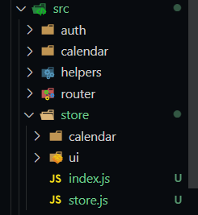
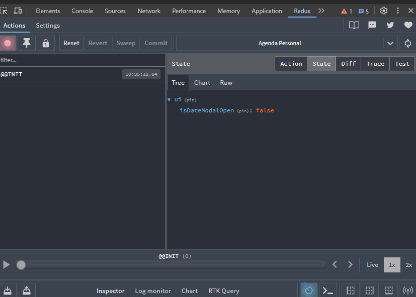

# Instalación y Configuración de Redux
Pensemos en un Store global, Redux nos va a facilitar este uso.
Tenemos los siguientes enlaces:
1. Redux toolkit: https://redux-toolkit.js.org/
2. Documentación oficial: https://react-redux.js.org/ 
3. Documentación en español: https://es.redux.js.org/
4. Cómo se hacía antes: https://www.npmjs.com/package/redux-thunk

En primero lugar, nos vamos al sitio de Redux toolkit, buscamos los pasos para la instalación, lo haremos con el comando: `npm install @reduxjs/toolkit`, luego instalamos react redux `npm install react-redux`, este nos ofrece el provider, hooks, etc.

Nos vamos a `package.json` y verificamos:
```json
"dependencies": {
    "@reduxjs/toolkit": "^2.2.3",
    "date-fns": "^3.6.0",
    "react": "^18.2.0",
    "react-big-calendar": "^1.11.2",
    "react-datepicker": "^6.6.0",
    "react-dom": "^18.2.0",
    "react-modal": "^3.16.1",
    "react-redux": "^9.1.0",
    "react-router-dom": "^6.22.3",
    "sweetalert2": "^11.10.7"
  },
```

Ahora, con esto instalado, ocupamos crear unos `Slices`, nos ayudan con las `acciones`, el `reducer` y con los `states`.

- En `/src` nos creamos una carpeta que se llame `/store`, dentro de esta carpeta creamos un archivo de barril `index.js`, asimismo el `store.js`, también creamos otra que se llame `/ui` otra que se llame `/calendar`, quedando así:



nos dirigimos hacia nuestro archivo de barril, y exportamos
```js
export * from './store';
```

Ahora creamos dentro de la carpeta `/ui` un archivo que se llame `uiSlice.js` y configuramos:
```jsx
// este me va a servir para mantener la información de ui
//si el modal está abierto, está cerrado, cualquier cosa que tenga que ver nuestra UI

import { createSlice } from '@reduxjs/toolkit';

export const uiSlice = createSlice({
    name: 'ui',
    initialState: {
        isDateModalOpen: false
    },
    reducers: {
        //aquí creamos las acciones
        onOpenDateModal: (state) => {
            state.isDateModalOpen = true;
        },
        onCloseModalOpen: (state) => {
            state.isDateModalOpen = false;
        },

    }
});

export const { onOpenDateModal, onCloseModalOpen } = uiSlice.actions;
```

Este fragmento de código utiliza Redux Toolkit para definir un slice llamado ui. Vamos a desglosarlo paso a paso:

1. Importación de `createSlice`: La primera línea importa la función `createSlice` del módulo `@reduxjs/toolkit`. Esta función nos permite crear un slice de estado en Redux de manera más concisa y eficiente.

2. Creación del slice `ui`: 
- Se define un nuevo slice llamado `ui` utilizando `createSlice`.
- El slice representa una parte específica del estado global de la aplicación (en este caso, relacionada con la interfaz de usuario). 
- El slice tiene un **nombre** (`name`) que se utiliza para generar los tipos de acción y facilitar la depuración.

3. Estado inicial (`initialState`):
- El objeto `initialState` define el estado inicial del `slice`.
- En este caso, el estado inicial tiene una sola propiedad: `isDateModalOpen`, que se inicializa en `false`.

4. Acciones (reducers):
    - Dentro del slice, se definen dos acciones: `onOpenDateModal` y `onCloseModalOpen`.
    - Cada acción es una función que toma el estado actual como argumento y puede modificarlo.
    -  `onOpenDateModal` establece isDateModalOpen en `true`.
    - `onCloseModalOpen` establece isDateModalOpen en `false`.

5. Exportación de las acciones:
    - Al final del código, se exportan las acciones creadas (`onOpenDateModal` y `onCloseModalOpen`) utilizando la sintaxis de desestructuración.
    - Estas acciones pueden ser utilizadas en otros lugares de la aplicación para actualizar el estado del slice ui.

Nos vamos ahora a nuestro archivo de barril que tenemos en `/store` y modificamos:
```js

export * from './ui/uiSlice';

export * from './store';

``` 

ahora, que tenemos nuestro arcivo de barril, podemos ir a modificar nuestro `store.js`
```jsx
import { configureStore } from '@reduxjs/toolkit';
import { uiSlice } from './';

export const store = configureStore({
    reducer: {
        ui: uiSlice.reducer
    }
})
``` 

básicamente, este es nuestro store.
Aquí se configuró la tienda Redux utilizando configureStore. Se pasa un objeto de configuración como argumento, donde se especifica el reductor (reducer). En este caso, el reductor ui está asociado al reductor del slice de estado uiSlice. Esto significa que el estado manejado por uiSlice estará bajo la clave ui en el estado global de la tienda Redux.

Ahora, lo debemos colocar en el punto más alto de nuestra aplicación o en un punto en el cual ya podamos empezar a consumirlo, nos vamos `CalendarApp.jsx`

```jsx
import { BrowserRouter } from 'react-router-dom';
import { AppRouter } from './router';
import { Provider } from 'react-redux'; // importamos el Provider
import { store } from './store';// importamos el store

export const CalendarApp = () => {

  return (
    <Provider store={ store } >
      <BrowserRouter>
        <AppRouter />
      </BrowserRouter>
    </Provider>
  )
}
```

Vamos al navegador web podemos irnos a la pestaña de redux, y tenemos la parte del ui y tenemos nuestro `isDateModalOpen` en falso y eso es todo lo que quiero hacer por estos momentos, basado en este valor de mi store es como que es lo que voy a usar yo para abrir y cerrar este modal, pero por ahora nos quedaremos hasta acá, ya configuramos redux y nuestro slice y reducer, acciones y un montón de cosas.

