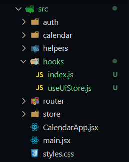

# Mostrar y ocultar modal con base en el Store

> Descargar la extensión **Better Comments** para darle énfasis a los comentarios

En esta sección, vamos a trabajar con el `Store`, basado en hooks, hooks personalizados, trabajar así da mucha más facilidad y evita un montón de importaciones, todo todo va a radicar en el `isDateModalOpen` para abrir y cerrar el modal, pero necesito hacer dispatch de acciones y esas acciones necesitamos hacer algo para controlarlas.

Lo primero que haremos es crear en `/src` una carpeta que se llame `/hooks` que contendrá el archivo de barril `index.js`.

Crearemos un hook llamado `useUiStore.js`. Este es un hook que me va a servir para manejar y hacer dispatch de acciones y controlar propiamente todo lo que está relacionado a mi `ui` en el store, lo mismo voy a hacer para el calendario y todos lo voy a hacer basado en hooks, descubriremos qué sencillo termina siendo el consumo del mismo.



```js
import { useSelector } from 'react-redux';

export const useUiStore = () => {
    // necesitamos tomar las propiedades, para eso usamos useSelector
    // con esto yo tengo acceso al state
    // y voy a desestructura para traer las propiedades que me interesan
    const { isDateModalOpen } = useSelector ( state => state.ui );
    // esta propiedad, estará cambiando a true o false dependiendo cómo cambie el state

    return {
        // * properties
        isDateModalOpen
        
        // * métodos
    }

}
``` 

Ahora nos vamos al archivo de barril `index.js` 
```js

export * from './useUiStore';

```

Volvemos a nuestro Slice que se llama `uiSlice.js` y configuramos
```jsx
// este me va a servir para mantener la información de ui
//si el modal está abierto, está cerrado, cualquier cosa que tenga que ver nuestra UI

import { createSlice } from '@reduxjs/toolkit';

export const uiSlice = createSlice({
    name: 'ui',
    initialState: {
        isDateModalOpen: false
    },
    reducers: {
        //aquí creamos las acciones
        onOpenDateModal: (state) => {
            state.isDateModalOpen = true;
        },
        onCloseDateModal: (state) => {
            state.isDateModalOpen = false;
        },

    }
});

export const { onOpenDateModal, onCloseDateModal } = uiSlice.actions;
``` 

Ahora, nos dirigimos hacia `CalendarModal.jsx` y vamos a importar nuestro custom hook porque ahí necesitaremos

```jsx
import { useMemo, useState } from 'react';
import { addHours, differenceInSeconds } from 'date-fns';
import Modal from 'react-modal';
import DatePicker, { registerLocale } from 'react-datepicker'; 
import 'react-datepicker/dist/react-datepicker.css'; 
import es from 'date-fns/locale/es';
import Swal from 'sweetalert2';
import { useUiStore } from '../../hooks';// importar useUiStore, este me ofrece isDateModalOpen por ahorita


// mandar el idioma en español
registerLocale ( 'es', es );

const customStyles = {
    content: {
      top: '50%',
      left: '50%',
      right: 'auto',
      bottom: 'auto',
      marginRight: '-50%',
      transform: 'translate(-50%, -50%)',
    },
};

Modal.setAppElement('#root');

export const CalendarModal = () => {

    // aquí necesito saber si mi calendario está abierto o no
    // importamos nuestro custom hook
    const { isDateModalOpen } = useUiStore();
    // esta variable es la que mandaré a la propiedad del Modal en isOpen

    // ! e l i m i n a r const [ isOpen, setIsOpen ] = useState(true);

    const [ formSubmitted, setFormSubmitted ] = useState(false);

    const [ formValues, setFormValues ] = useState({
        title: 'Nestor',
        notes: 'Rivas',
        start: new Date(),
        end: addHours ( new Date(), 2 ),
    });

    const titleClass = useMemo (() => {

        if( !formSubmitted ) return '';

        return ( formValues.title.length > 0 )
        ? 'is-valid'
        : 'is-invalid'


    }, [ formValues.title, formSubmitted ])

    const onInputChanged = ({ target }) => {
        setFormValues({
            ...formValues,
            [ target.name ]: target.value
        })
    }

    const onDateChanged = ( event, changing) => {
        setFormValues({
            ...formValues,
            [ changing ]: event
        })
    }

    const onCloseModal = () => {
        console.log('Cerrando Modal');

        // ! e l i m i n a r setIsOpen( false );
    }

    const onSubmit = (event) => {

        event.preventDefault();
        setFormSubmitted(true);

        const difference = differenceInSeconds( formValues.end, formValues.start );
        console.log({ difference });

        if ( isNaN(difference) || difference <= 0 ) {
            Swal.fire('Fechas incorrectas', 'Revisas fechas ingresadas', 'error');
            return;
        }

        if ( formValues.title.length <= 0 ) {
            return;
        }

        console.log(formValues);
    }

    return(
        <Modal
            isOpen={ isDateModalOpen }// viene del custom hook
            onRequestClose={ onCloseModal }
            style={customStyles}
            className='modal' 
            overlayClassName='modal-fondo' 
            closeTimeoutMS={ 200 } 
        >
            <h1> Nuevo evento </h1>
            <hr />
            <form className="container" onSubmit={ onSubmit }>

                <div className="form-group mb-2">
                    <label>Fecha y hora inicio</label>
                    <DatePicker
                        selected={ formValues.start }
                        className='form-control'
                        onChange={ (event) => onDateChanged(event, 'start') }
                        dateFormat='Pp'

                        showTimeSelect 
                        locale='es' 
                        timeCaption='Hora' 
                    />
                </div>

                <div className="form-group mb-2">
                    <label>Fecha y hora fin</label>
                    <DatePicker
                        minDate={ formValues.start }
                        selected={ formValues.end }
                        className='form-control'
                        onChange={ (event) => onDateChanged(event, 'end') }
                        dateFormat='Pp'

                        showTimeSelect 
                        locale='es' 
                        timeCaption='Hora' 
                    />
                </div>

                <hr />
                <div className="form-group mb-2">
                    <label>Titulo y notas</label>
                    <input 
                        type="text" 
                        className={`form-control ${ titleClass } `} // modificamos
                        placeholder="Título del evento"
                        name="title"
                        autoComplete="off"

                        value={ formValues.title }
                        onChange={ onInputChanged }
                    />
                    <small id="emailHelp" className="form-text text-muted">Una descripción corta</small>
                </div>

                <div className="form-group mb-2">
                    <textarea 
                        type="text" 
                        className="form-control"
                        placeholder="Notas"
                        rows="5"
                        name="notes"

                        value={ formValues.notes }
                        onChange={ onInputChanged }
                    ></textarea>
                    <small id="emailHelp" className="form-text text-muted">Información adicional</small>
                </div>

                <button
                    type="submit"
                    className="btn btn-outline-primary btn-block"
                >
                    <i className="far fa-save"></i>
                    <span> Guardar</span>
                </button>

            </form>

        </Modal>
    )
}
```

Vamos al navegador, recargamos y por defecto no se abre el modal, luego podemos ir a cambiar en el `uiSlice.js` y ponemos en *true* la parte del `state.isDateModalOpen` y veremos que sí se abre cuando hacemos eso, y luego cambiamos a *false*. Básicamente esto es el juego que necesito hacer.

Para abrir el modal, tenemos que hacer esto cuando demos doble clic en el cuadrito del evento. ¿Cómo haremos entonces para abrir el modal? Pues, todo lo queremos manejar a través del custom hook `useUiStore.js`, modifiquemos...

```js
import { useSelector, useDispatch } from 'react-redux';// importar useDispatch
import { onOpenDateModal } from '../store';// importar del store

export const useUiStore = () => {

    const { 
        isDateModalOpen 
    } = useSelector ( state => state.ui );

    // crearemos una función que me sirva para abrir el modal
    // tenemos que llegar al store y decirle que ejecute una acción

    // para poder llegar al reducer, necesitamos dispatch de una acción
    const dispatch = useDispatch();// esto lo quiero de manera interna para trabajar con él

    const openDateModal = () => {
        dispatch( onOpenDateModal() );
    }

    return {
        // * properties
        isDateModalOpen,

        // * métodos
        openDateModal, // ? en mi custom hook de useUiStore tengo el poder de abrir el modal con esto
    }

}
```

Nos vamos ahora en `CalendarPage.jsx`
* Ver en comentarios las modificaciones

```jsx
import { useState } from 'react';
import { Calendar } from 'react-big-calendar';
import 'react-big-calendar/lib/css/react-big-calendar.css';

import { addHours } from 'date-fns';
import { CalendarEvent, CalendarModal, Navbar } from "../";
import { localizer, getMessagesES } from '../../helpers';
import { useUiStore } from '../../hooks';// importar useUiStore


const events = [{
  title: 'Cumpleaños del team leader',
  notes: 'Comprar una taza de spiderman pequeño',
  start: new Date(),
  end: addHours( new Date(), 2 ),
  bgColor: '#fafafa',
  user: {
    _id: '123',
    name: 'Nestor'
  }
}]


export const CalendarPage = () => {

  // aquí usaremos el custom hook useUiStore
  const { openDateModal } = useUiStore();// este método lo llamaré cuando se hace doble clic

  const [ lastView, setLastView ] = useState(localStorage.getItem('lastView') || 'agenda');

  const eventStyleGetter = ( event, start, end, isSelected ) => {

    const style = {
      backgroundColor: '#347cf7',
      borderRadius: '0px',
      opacity: 0.8,
      color: 'white'
    }
    
    return{
      style
    }

  }

  const onDoubleClick = ( event ) => {
    // console.log({ doubleClick: event });
    // aquí mandamos a llamar openDateModal
    openDateModal();
  }

  const onSelect = ( event ) => {
    console.log({ click: event });
  }

  const onViewChange = ( event ) => {

    localStorage.setItem('lastView', event );
    
  }

  return (
    <>
      <Navbar />

      <Calendar
        culture='es'
        localizer={ localizer }
        events={ events }
        startAccessor="start"
        endAccessor="end"
        style={{ height: 'calc( 100vh - 80px)' }}
        messages={ getMessagesES() }
        eventPropGetter={ eventStyleGetter }
        components={{
          event: CalendarEvent
        }}
        onDoubleClickEvent={ onDoubleClick }
        onSelectEvent={ onSelect }
        onView={ onViewChange }
        defaultView={ lastView }
      />

       <CalendarModal />

    </>
  )
}
```

## Tarea
Es tarea de los estudiantes, hacer que el modal se cierre cuando damos clic afuera, en el `useUiStore.jsx` se van a crear los respectivos, constante `closeDateModal` y hacen la implementación respectiva...

> Resolvamos juntos...

```jsx
import { useSelector, useDispatch } from 'react-redux';
import { onOpenDateModal, onCloseDateModal } from '../store';// importar del store

export const useUiStore = () => {

    const dispatch = useDispatch();

    const { 
        isDateModalOpen 
    } = useSelector ( state => state.ui );

    const openDateModal = () => {
        dispatch( onOpenDateModal() );
    }

    // creamos función para cerrar
    const closeDateModal = () => {
        dispatch( onCloseDateModal() );
    }

    return {
        // * properties
        isDateModalOpen,

        // * métodos
        openDateModal,
        closeDateModal, // lo ponemos al mundo exterior para ser consumido
    }

}
```

Ahora, tenemos que llamar esa nueva función para cerrar, en `CalendarModal.jsx`
* ver en comentarios las modificaciones:
```jsx
import { useMemo, useState } from 'react';
import { addHours, differenceInSeconds } from 'date-fns';
import Modal from 'react-modal';
import DatePicker, { registerLocale } from 'react-datepicker'; 
import 'react-datepicker/dist/react-datepicker.css'; 
import es from 'date-fns/locale/es';
import Swal from 'sweetalert2';
import { useUiStore } from '../../hooks';


// mandar el idioma en español
registerLocale ( 'es', es );

const customStyles = {
    content: {
      top: '50%',
      left: '50%',
      right: 'auto',
      bottom: 'auto',
      marginRight: '-50%',
      transform: 'translate(-50%, -50%)',
    },
};

Modal.setAppElement('#root');

export const CalendarModal = () => {

    // extraer la función que nos interesa, en este caso closeDateModal
    const { isDateModalOpen, closeDateModal } = useUiStore();

    const [ formSubmitted, setFormSubmitted ] = useState(false);

    const [ formValues, setFormValues ] = useState({
        title: 'Nestor',
        notes: 'Rivas',
        start: new Date(),
        end: addHours ( new Date(), 2 ),
    });

    const titleClass = useMemo (() => {

        if( !formSubmitted ) return '';

        return ( formValues.title.length > 0 )
        ? 'is-valid'
        : 'is-invalid'


    }, [ formValues.title, formSubmitted ])

    const onInputChanged = ({ target }) => {
        setFormValues({
            ...formValues,
            [ target.name ]: target.value
        })
    }

    const onDateChanged = ( event, changing) => {
        setFormValues({
            ...formValues,
            [ changing ]: event
        })
    }

    const onCloseModal = () => {
        // colocamos aquí la función para cerrar modal
        closeDateModal();

    }

    const onSubmit = (event) => {

        event.preventDefault();
        setFormSubmitted(true);

        const difference = differenceInSeconds( formValues.end, formValues.start );
        console.log({ difference });

        if ( isNaN(difference) || difference <= 0 ) {
            Swal.fire('Fechas incorrectas', 'Revisas fechas ingresadas', 'error');
            return;
        }

        if ( formValues.title.length <= 0 ) {
            return;
        }

        console.log(formValues);
    }

    return(
        <Modal
            isOpen={ isDateModalOpen }// viene del custom hook
            onRequestClose={ onCloseModal }
            style={customStyles}
            className='modal' 
            overlayClassName='modal-fondo' 
            closeTimeoutMS={ 200 } 
        >
            <h1> Nuevo evento </h1>
            <hr />
            <form className="container" onSubmit={ onSubmit }>

                <div className="form-group mb-2">
                    <label>Fecha y hora inicio</label>
                    <DatePicker
                        selected={ formValues.start }
                        className='form-control'
                        onChange={ (event) => onDateChanged(event, 'start') }
                        dateFormat='Pp'

                        showTimeSelect 
                        locale='es' 
                        timeCaption='Hora' 
                    />
                </div>

                <div className="form-group mb-2">
                    <label>Fecha y hora fin</label>
                    <DatePicker
                        minDate={ formValues.start }
                        selected={ formValues.end }
                        className='form-control'
                        onChange={ (event) => onDateChanged(event, 'end') }
                        dateFormat='Pp'

                        showTimeSelect 
                        locale='es' 
                        timeCaption='Hora' 
                    />
                </div>

                <hr />
                <div className="form-group mb-2">
                    <label>Titulo y notas</label>
                    <input 
                        type="text" 
                        className={`form-control ${ titleClass } `}
                        placeholder="Título del evento"
                        name="title"
                        autoComplete="off"

                        value={ formValues.title }
                        onChange={ onInputChanged }
                    />
                    <small id="emailHelp" className="form-text text-muted">Una descripción corta</small>
                </div>

                <div className="form-group mb-2">
                    <textarea 
                        type="text" 
                        className="form-control"
                        placeholder="Notas"
                        rows="5"
                        name="notes"

                        value={ formValues.notes }
                        onChange={ onInputChanged }
                    ></textarea>
                    <small id="emailHelp" className="form-text text-muted">Información adicional</small>
                </div>

                <button
                    type="submit"
                    className="btn btn-outline-primary btn-block"
                >
                    <i className="far fa-save"></i>
                    <span> Guardar</span>
                </button>

            </form>

        </Modal>
    )
}
```

Con esto, ya podemos ver que el modal se abre cuando damos doble clic, y se cierra cuando clickamos fuera del mismo.

