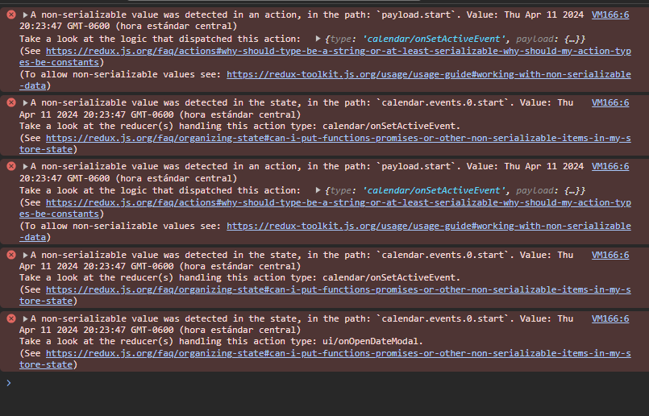

# Preparar la creación de un nuevo evento

En esa ocasión, vamos a crear un botón flotante el cual me permita hacer Clic y a la vez lanzar el modal, o sea, se va a abrir el modal pero las fechas y los valores que van a estar dentro, van a estar en blanco, en teoría, solo para que tengamos una idea de cómo podríamos hacer esto con el código que ya tenemos implementado es que en lugar de hacer doble Clic y mandar la nota activa o la nota seleccionada, puedo mandar una nota ficticia sin el ID, y eso nos va a dar la a diferenciación si está creando una nueva o está actualizando una nueva nota o un nuevo evento.

## Creación del Floating Action Button
Nos dirigimos a la carpeta `/components` que está dentro de la carpeta `/calendar` y creamos un nuevo componente, este se llamará `FabAddNew.jsx` 
```jsx

export const FabAddNew = () => {
  return (
    <div>
      FabAddNew
    </div>
  )
}

```

Nos creamos este componente que contendrá acciones y manejará partes del store.
Antes de seguir con el componente del fab, pongamos en el archivo `styles.css` el siguiente código de estilos para el botón flotante.
```css
/* FABS */
.fab {
  border-radius: 100%;
  bottom: 25px;
  font-size: 30px;
  padding: 25px;
  position: fixed;
  right: 25px;
}

.fab-danger {
  border-radius: 100%;
  bottom: 25px;
  font-size: 22px;
  position: fixed;
  left: 25px;
  width: 70px;
  height: 70px;
}
```

Ahora sí, modifiquemos el componente `FabAddNew.jsx`
```jsx

export const FabAddNew = () => {
  return (
    <button
        className="btn btn-primary fab"
    >
        <i className="fas fa-plus"></i>
    </button>
  )
}
```

Lo que prosigue, es que vamos a exportarlo en el archivo de barril `index.js` de nuestra carpeta `/calendar`
```js

export * from './components/CalendarEvent';
export * from './components/CalendarModal';
export * from './components/FabAddNew';// exportar FabAddNew, todo ordenado alfabéticamente
export * from './components/Navbar';

export * from './pages/CalendarPage';

```

Nos dirigimos a `CalendarPage.jsx` y justo debajo del componente renderizado `<CalendarModal />` podemos renderizar nuestro `<FabAddNew />`
* ver en comentarios las modificaciones o código agregado

```jsx
import { useState } from 'react';
import { Calendar } from 'react-big-calendar';
import 'react-big-calendar/lib/css/react-big-calendar.css';

import { CalendarEvent, CalendarModal, FabAddNew, Navbar } from "../"; // aquí se importa el FabAddNew
import { localizer, getMessagesES } from '../../helpers';
import { useUiStore, useCalendarStore } from '../../hooks';


export const CalendarPage = () => {

  const { openDateModal } = useUiStore();

  const { events, setActiveEvent } = useCalendarStore();

  const [ lastView, setLastView ] = useState(localStorage.getItem('lastView') || 'agenda');

  const eventStyleGetter = ( event, start, end, isSelected ) => {

    const style = {
      backgroundColor: '#347cf7',
      borderRadius: '0px',
      opacity: 0.8,
      color: 'white'
    }
    
    return{
      style
    }

  }

  const onDoubleClick = ( event ) => {
    openDateModal();
  }

  const onSelect = ( event ) => {
    // console.log({ click: event });
    setActiveEvent( event );
  }

  const onViewChange = ( event ) => {

    localStorage.setItem('lastView', event );
    setLastView( event );
    
  }

  return (
    <>
      <Navbar />

      <Calendar
        culture='es'
        localizer={ localizer }
        events={ events }
        startAccessor="start"
        endAccessor="end"
        style={{ height: 'calc( 100vh - 80px)' }}
        messages={ getMessagesES() }
        eventPropGetter={ eventStyleGetter }
        components={{
          event: CalendarEvent
        }}
        onDoubleClickEvent={ onDoubleClick }
        onSelectEvent={ onSelect }
        onView={ onViewChange }
        defaultView={ lastView }
      />

       <CalendarModal />

       {/* Renderizar FabAddNew */}
       <FabAddNew />

    </>
  )
}
```

Ahora, si vemos en el Navegador ya debería aparecer el botón flotante. Pero al presionarlo, no pasa nada, sin embargo, al dar doble clic en el cuadrito del evento, tenemos errores:



Esto, en pocas palabras dice que no logra serealizar correctamente la fecha. Usualmente cuando ustedes están trabajando con fechas ya sea de JS, o de cualquier otra cosa, usualmente se convierte las fechas a un número; es decir se maneja el número y no se maneja la fecha porque es un poco difícil de trabajar con ella, o serializar. pero intencionalmente lo estoy dejando así para explicarles algo algo que posiblemente en un futuro ustedes lleguen a necesitar si están trabajando con *redux* en general, por ahora ignoremos ese error, por ahora.

Nos dirigimos entonces a `FabAddNew.jsx` y en ese componente necesito realizar el dispatch de ciertas acciones por ejemplo cuando yo hago Clic en el botón quiero abrir el modal principalmente y a la vez quiero activar una nota para que la persona pueda ver la nota activa, para hacer esto voy a ocupar mis 2 hooks que tienen relación según este.

```jsx
import { useUiStore } from '../../hooks';


export const FabAddNew = () => {

    const { openDateModal } = useUiStore(); // tomamos nuestro hook para abrir el modal

    const handleClickNew = () => {
        // por ahora no recibe ningún argumento, sólo llama openDateModal();
        openDateModal();
    }


  return (
    <button
        className="btn btn-primary fab"
        onClick={ handleClickNew } // colocamos el handle
    >
        <i className="fas fa-plus"></i>
    </button>
  )
}
``` 

Vamos al navegador, damos clic, y se abre de forma vacía, está bien, pero ... es mejor asegurarse de limpiar la nota anterior, entonces para limpiar la nota anterior, porque puede ser que estoy viendo una nota activa anterior o cualquier otra cosa entonces vamos a limpiarlo y para eso vamos a ocupar el *useCalendarStore*, regresamos a `FabAddNew.jsx`

```jsx
import { addHours } from 'date-fns'; // importar addHours
import { useCalendarStore, useUiStore } from '../../hooks'; // importamos useCalendarStore


export const FabAddNew = () => {

    const { openDateModal } = useUiStore();
    const { setActiveEvent } = useCalendarStore(); // de aquí me interesa tomar setActiveEvent

    const handleClickNew = () => {
        // Nuevo evento activo que voy a llamar antes de que se abra el modal
        // será de la misma estructura de lo que estoy esperando
        // debemos ir a calendarSlice, y copiarnos lo que está en "tempEvent"

        setActiveEvent({
            // ! e l i m i n ar -> _id: new Date().getTime(), no va a tener un id
            // ! no tener un id me va a dar a conocer si estoy activanto uno nuevo
            // porque si tiene id significa que estaría modificando una nota existente
            title: 'Hola',
            notes: 'Mundooo',
            start: new Date(),
            end: addHours( new Date(), 2 ),
            bgColor: '#fafafa',
            user: {
                _id: '123',
                name: 'Nestor'
            }
        });
        openDateModal();
    }


  return (
    <button
        className="btn btn-primary fab"
        onClick={ handleClickNew }
    >
        <i className="fas fa-plus"></i>
    </button>
  )
}
``` 

Ahora, si verificamos en el navegador, ya aparece tal y como nosotros lo mandamos desde el fab.
Una vez probando esto, ya podemos quitar el "Hola Mundooo" porque sólo fue para verificar que se hiciera correctamente.

Por ahora, quedamos hasta acá, pueden ver que tenemos las interacciones, y luego como es muy interesante y sencillo a la larga cuando ya tenemos configurado en estos custom hooks y ya tenemos conectados nuestros slices con las acciones, todo termina siendo muy sencillo después.