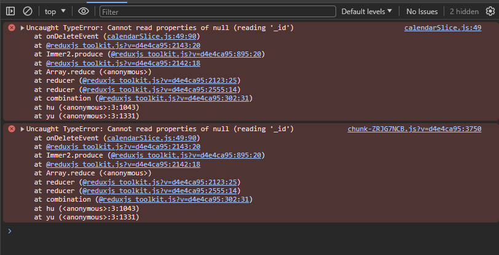

# Eliminar evento
En esta sección es que cuando se haga clic en el evento, aparezca un botón que sirva para eliminar la nota activa.

Creamos un nuevo componente en la carpeta de `/components` que está dentro de `/calendar`, el componente nuevo se llamará `FabDelete.jsx`

```jsx
import { useCalendarStore, useUiStore } from '../../hooks';


export const FabDelete = () => {


    const handleDelete = () => {

    }


  return (
    <button
        className="btn btn-danger fab-danger"
        onClick={ handleDelete }
    >
        <i className="fas fa-trash-alt"></i>
    </button>
  )
}
``` 

Luego, hacemos la exportación de este, en nuestro archivo de barril.

```js

export * from './components/CalendarEvent';
export * from './components/CalendarModal';
export * from './components/FabAddNew';
export * from './components/FabDelete'; // importar FabDelete
export * from './components/Navbar';

export * from './pages/CalendarPage';

``` 

Ahora, vamos a utilizar este *FabDelete* en nuestro `CalendarPage.jsx` 
* ver las modificaciones en comentarios:

```jsx
import { useState } from 'react';
import { Calendar } from 'react-big-calendar';
import 'react-big-calendar/lib/css/react-big-calendar.css';

import { CalendarEvent, CalendarModal, FabAddNew, FabDelete, Navbar } from "../"; // aquí se importa el FabDelete
import { localizer, getMessagesES } from '../../helpers';
import { useUiStore, useCalendarStore } from '../../hooks';


export const CalendarPage = () => {

  const { openDateModal } = useUiStore();

  const { events, setActiveEvent } = useCalendarStore();

  const [ lastView, setLastView ] = useState(localStorage.getItem('lastView') || 'agenda');

  const eventStyleGetter = ( event, start, end, isSelected ) => {

    const style = {
      backgroundColor: '#347cf7',
      borderRadius: '0px',
      opacity: 0.8,
      color: 'white'
    }
    
    return{
      style
    }

  }

  const onDoubleClick = ( event ) => {
    openDateModal();
  }

  const onSelect = ( event ) => {
    setActiveEvent( event );
  }

  const onViewChange = ( event ) => {

    localStorage.setItem('lastView', event );
    setLastView( event );
    
  }

  return (
    <>
      <Navbar />

      <Calendar
        culture='es'
        localizer={ localizer }
        events={ events }
        startAccessor="start"
        endAccessor="end"
        style={{ height: 'calc( 100vh - 80px)' }}
        messages={ getMessagesES() }
        eventPropGetter={ eventStyleGetter }
        components={{
          event: CalendarEvent
        }}
        onDoubleClickEvent={ onDoubleClick }
        onSelectEvent={ onSelect }
        onView={ onViewChange }
        defaultView={ lastView }
      />

       <CalendarModal />

       <FabAddNew />

       {/* Renderizar FabDelete */}
       <FabDelete />

    </>
  )
}
```

En el navegador, ya deberíamos estar viendo el botón flotante con el ícono de eliminar y de color rojo.

Ahora lo que tenemos que hacer es el reducer, disparar la acción y hacer modificaciones...
Nos vamos al `calendarSlice.js`

* Ver en comentarios las modificaciones:

```jsx
import { createSlice } from '@reduxjs/toolkit';
import { addHours } from 'date-fns';

const tempEvent = {
    _id: new Date().getTime(),
    title: 'Cumpleaños del team leader',
    notes: 'Comprar una taza de spiderman pequeño',
    start: new Date(),
    end: addHours( new Date(), 2 ),
    bgColor: '#fafafa',
    user: {
        _id: '123',
        name: 'Nestor'
    }
};

export const calendarSlice = createSlice({
    name: 'calendar',
    initialState: {
        events: [
            tempEvent
        ],
        activeEvent: null 
    },
    reducers: {
        onSetActiveEvent: (state, { payload }) => {
            state.activeEvent = payload;
        },
        onAddNewEvent: (state, { payload }) => {
            state.events.push(payload);
            state.activeEvent = null;
        },
        onUpdateEvent: (state, { payload }) => {
           
            state.events = state.events.map( event => {
               
                if ( event._id === payload._id ) {
                    return payload;
                }

                return event;
            })
        },
        onDeleteEvent: ( state ) => {
            // para hacer la eliminación no necesitamos payload
            // porque la eliminación basicamente es eliminar la nota activa

            // voy a regresar todos los eventos cuyo id sea diferente al de la nota activa
            state.events = state.events.filter( event => event._id !== state.activeEvent._id );
            state.activeEvent = null;
        }
    }

})

// exportar la acción onDeleteEvent
export const { onSetActiveEvent, onAddNewEvent, onUpdateEvent, onDeleteEvent } = calendarSlice.actions;

```

Regresemos al `useCalendarStore.jsx`, aquí nosotros vamos a ocupar una función para mandar a hacer el dispatch de esa acción

```jsx
import { useDispatch, useSelector } from 'react-redux';
import { onAddNewEvent, onDeleteEvent, onSetActiveEvent, onUpdateEvent } from '../store'; // importar onDeleteEvent

export const useCalendarStore = () => {

    const { events, activeEvent } = useSelector( state => state.calendar );

    const dispatch = useDispatch();

    const setActiveEvent = ( calendarEvent ) => {
        dispatch( onSetActiveEvent( calendarEvent) );
    }

    const startSavingEvent = async( calendarEvent ) => {

        if ( calendarEvent._id ) {
            // Actualizando
            dispatch( onUpdateEvent({ ...calendarEvent }) )

        } else {
            // Creando
            dispatch( onAddNewEvent({ ...calendarEvent, _id: new Date().getTime() }) )
            
        }
    }

    // TODO: Crear la función deleteEvent
    const deleteEvent = () => {
        dispatch( onDeleteEvent() );
    }

    return {
        //* propiedades
        events,
        activeEvent,

        //* métodos
        deleteEvent, // retornar deleteEvent
        setActiveEvent,
        startSavingEvent, 
    }
}
```

Ahora, nos vamos al `FabDelete.jsx`
```jsx
import { useCalendarStore, useUiStore } from '../../hooks';


export const FabDelete = () => {
  
  // necesitamos deleteEvente del useCalendarStore
  const { deleteEvent } = useCalendarStore();

  const handleDelete = () => {
    // mandamos a llamar el deleteEvent
    deleteEvent();
  }


  return (
    <button
        className="btn btn-danger fab-danger"
        onClick={ handleDelete }
    >
        <i className="fas fa-trash-alt"></i>
    </button>
  )
}
```

Si guardamos los cambios y nos vamos hacia el navegador, podremos ver que hay algunos errores, si damos clic en el botón *delete* por ende nos va a dar error, y está bien.



Al igual que el error de non-serializable, que aún no lo hemos corregido.

Pero, si seleccionamos el evento, y luego el botón de *delete* sí que nos hace la función, lo borra del calendario.

* Cuando no tenemos una nota activa, el botón no debería aparecer, tenemos que controlar que no se dispare, vamos a hacer esa lógica...

Podríamos editar en `calendarSlice.jsx` la parte del *onDeleteEvent*

```jsx

...
          onDeleteEvent: ( state ) => {
            // debemos dejar de intentar llamar si no tenemos ninguna nota activa, no se debe hacer nada

            // preguntamos si esto existe o no
            if ( state.activeEvent ) {
                state.events = state.events.filter( event => event._id !== state.activeEvent._id );
                state.activeEvent = null;
            }// si tenemos una nota activa entonces que lo elimine, caso contrario no haremos nada
          }
...

```
Ahora podemos ver en el navegador que sí se ejecuta la acción.

Otra cosa es que tenemos que determinar si tenemos una nota activa o no, para poder mostrar el botón *delete* o no. Entonces, nos vamos a `useCalendarStore.jsx` aquí, yo sé que si no tengo una nota activa tenemos *"activeEvent"* como nulo, y es todo lo que necesitamos para determinar si hay una nota activa o no.

```jsx
import { useDispatch, useSelector } from 'react-redux';
import { onAddNewEvent, onDeleteEvent, onSetActiveEvent, onUpdateEvent } from '../store'; 

export const useCalendarStore = () => {

    const { events, activeEvent } = useSelector( state => state.calendar );

    const dispatch = useDispatch();

    const setActiveEvent = ( calendarEvent ) => {
        dispatch( onSetActiveEvent( calendarEvent) );
    }

    const startSavingEvent = async( calendarEvent ) => {

        if ( calendarEvent._id ) {
            // Actualizando
            dispatch( onUpdateEvent({ ...calendarEvent }) )

        } else {
            // Creando
            dispatch( onAddNewEvent({ ...calendarEvent, _id: new Date().getTime() }) )
            
        }
    }

    // en realidad acá la eliminación no es síncrona tampoco
    // porque nosotros tenemos que llegar al backend, el backend lo elimina
    // y cuando el backend lo elimina, nos va a llegar una respuesta que me diga:
    // se eliminó correctamente o no se encontró ninguna nota 
    // entonces esto se debería llamar startDeletingEvent
    const startDeletingEvent = () => {
        // aquí debería llegar al backend

        dispatch( onDeleteEvent() );
    }

    return {
        //* propiedades
        events,
        activeEvent,
        hasEventSelected: !!activeEvent, // si esto es null entonces resgresa false, si tiene un objeto regresa true, en mi custom hook ya puedo saber si hay un evento seleccionado o no

        //* métodos
        startDeletingEvent, // retornar el startDeletingEvent
        setActiveEvent,
        startSavingEvent, 
    }
}
```

Ahora, vamos a modificar en `FabDelete.jsx`

```jsx
import { useCalendarStore, useUiStore } from '../../hooks';


export const FabDelete = () => {
  
  const { startDeletingEvent } = useCalendarStore(); // modificar nombre

  const handleDelete = () => {
    startDeletingEvent();
  }


  return (
    <button
        className="btn btn-danger fab-danger"
        onClick={ handleDelete }
    >
        <i className="fas fa-trash-alt"></i>
    </button>
  )
}
```

El comportamiento en el navegador debería ser el mismo. 
Entonces, vamos a ir a modificar en el `FabDelete.jsx` para que de manera condicional se oculte o se muestre el botón.

```jsx
import { useCalendarStore, useUiStore } from '../../hooks';


export const FabDelete = () => {
  
  // haremos que este botón sea autosuficiente
  // tomaremos la propiedad que creamos hasEventSelected
  // y con eso jugamos con el style para mostrar
  const { startDeletingEvent, hasEventSelected } = useCalendarStore();

  const handleDelete = () => {
    startDeletingEvent();
  }


  return (
    <button
        className="btn btn-danger fab-danger"
        onClick={ handleDelete }
        style={{
          display: hasEventSelected ? '' : 'none'
        }} // con esto ocultamos el botón
    >
        <i className="fas fa-trash-alt"></i>
    </button>
  )
}
```

Ahora nos vamos al navegador y vemos que funciona, sin embargo, hay cosas en las que debemos pensar y es que si tenemos el modal abierto, ese botón de *delete* no debería mostrarse, así mejorar la experiencia del usuario.